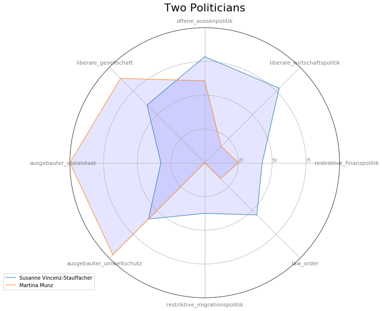

# Plot Smart Spiders in Python
## Description
This handy script prints Smart Spiders (Radar Charts) with data from www.smartvote.ch

## Installation
Copy the script `src/smartspider.py` to your code folder

## Usage
Create a Pandas DataFrame. The Axis of the Smart Spider must be stored in columns named like this:
* `offene_aussenpolitik`
* `liberale_wirtschaftspolitik`
* `restriktive_finanzpolitik`
* `law_order`
* `restriktive_migrationspolitik`
* `ausgebauter_umweltschutz`
* `ausgebauter_sozialstaat`
* `liberale_gesellschaft`

The function `plot_dataframe` takes four parameters:
* `df` The DataFrame itselfs (*required)
* `legend` A list used as legend (optional)
* `print_dataframe` Set to true to print the dataframe (default `false`)
* `title` Title of the chart (optional)

## Example
```python
#Import Modules
import pandas as pd
import smartspider

#Create empty DataFrame
df = pd.DataFrame()

#Add first spider
df = df.append({
    'name': 'Susanne Vincenz-Stauffacher',
    'offene_aussenpolitik':  78.5714,
    'liberale_wirtschaftspolitik': 78.125,
    'restriktive_finanzpolitik': 42.6471,
    'law_order': 54.6667,
    'restriktive_migrationspolitik': 37.5,
    'ausgebauter_umweltschutz': 58.9286,
    'ausgebauter_sozialstaat': 32.5,
    'liberale_gesellschaft': 60.5333
}, ignore_index=True)

#Add second Spider
df = df.append({
    'name': 'Martina Munz',
    'offene_aussenpolitik': 60.7143,
    'liberale_wirtschaftspolitik': 17.1875,
    'restriktive_finanzpolitik': 25,
    'law_order': 16.6667,
    'restriktive_migrationspolitik': 0,
    'ausgebauter_umweltschutz': 96.4286,
    'ausgebauter_sozialstaat': 100,
    'liberale_gesellschaft': 88.3333
}, ignore_index=True)

#Plot Spiders
smartspider.plot_dataframe(df, legend=df['name'], title='Two Politicians')
```
See Jupyter Notebook Example in [plot smartspider.ipynb](./demo/plot smartspider.ipynb).
## Result


